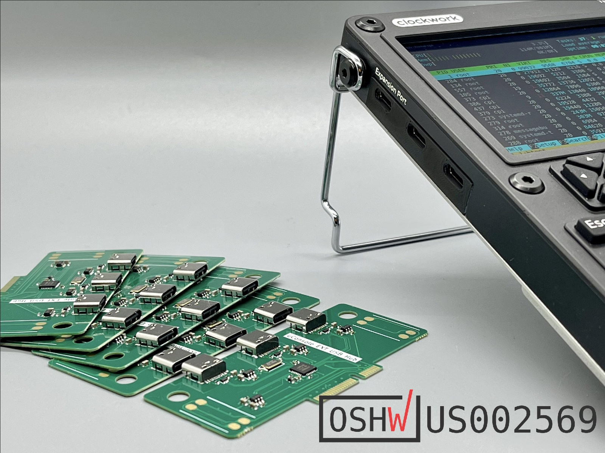

## μHub

### What is it?

μHub is USB Hub Expansion Card designed for [Clockwork uConsole](https://www.clockworkpi.com/uconsole).

### Features

* Internal Speakers Support
* 3 Type-C (USB 2.0) ports with power switch and overcurrent protection
* 1 Internal FFC (USB 2.0) port with power switch and overcurrent protection

## Resources

- [Cover Bracket 3D model](fab/cover.stl)
- [Schematics](fab/uhub.pdf)
- [PCB Viewer](https://kicanvas.org/?github=https%3A%2F%2Fgithub.com%2Fdotcypress%2Fuhub%2Fblob%2Fmain%2Fuhub.kicad_pcb)
- [Interactive BOM](https://htmlpreview.github.io/?https://github.com/dotcypress/uhub/blob/main/fab/ibom.html)

## License

Licensed under either of

- Apache License, Version 2.0 ([LICENSE-APACHE](LICENSE-APACHE) or
  http://www.apache.org/licenses/LICENSE-2.0)
- MIT license ([LICENSE-MIT](LICENSE-MIT) or http://opensource.org/licenses/MIT)

at your option.

### Contribution

Unless you explicitly state otherwise, any contribution intentionally submitted
for inclusion in the work by you, as defined in the Apache-2.0 license, shall be
dual licensed as above, without any additional terms or conditions.
